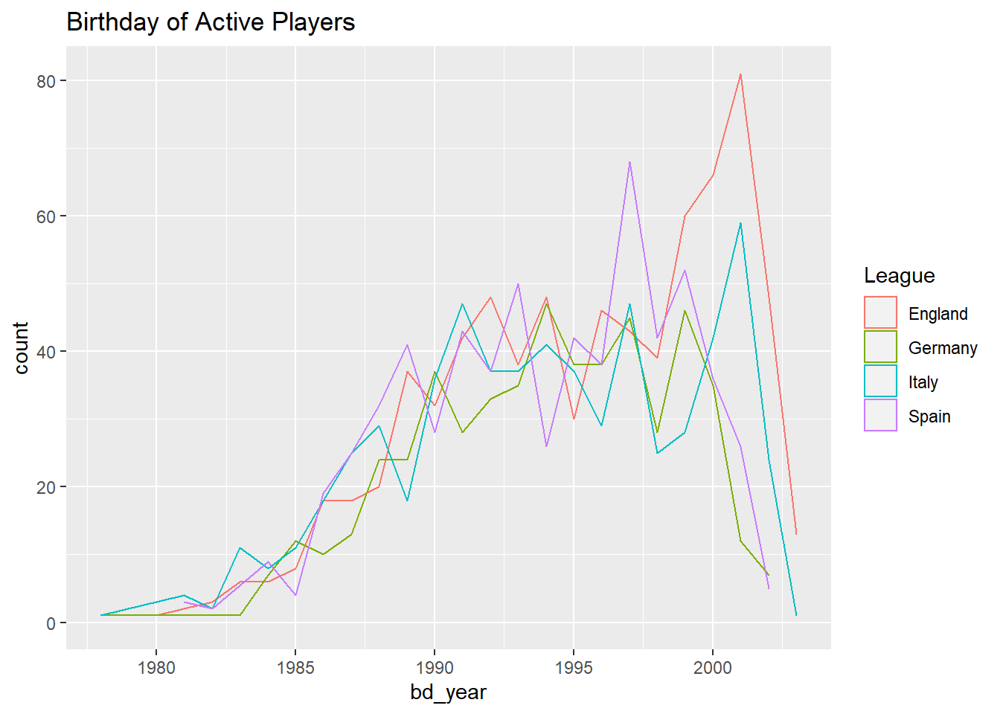
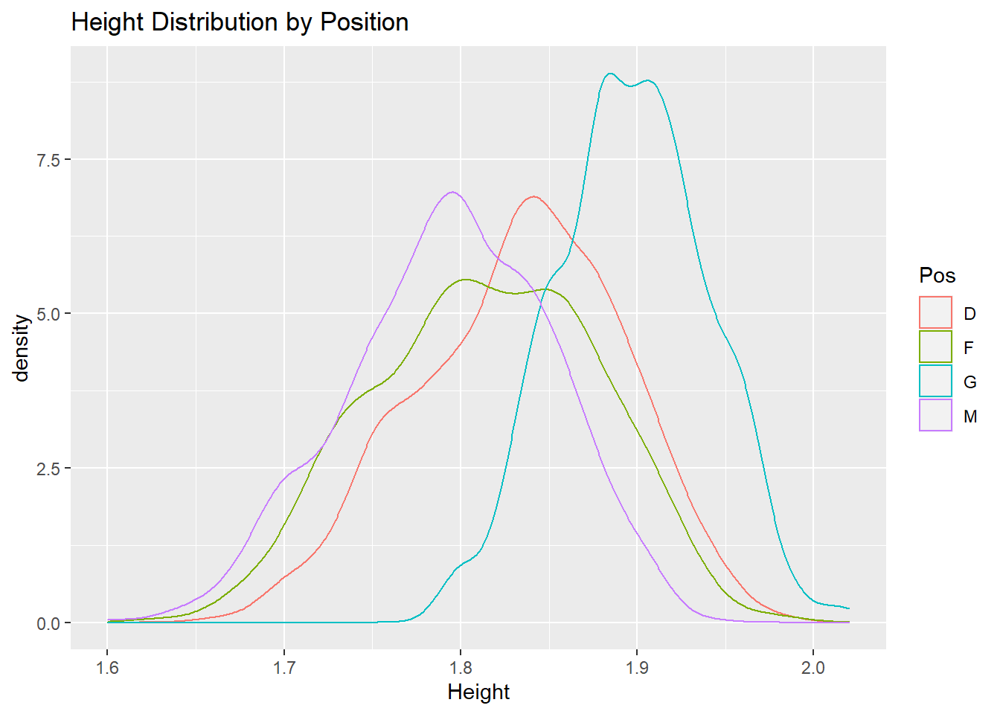
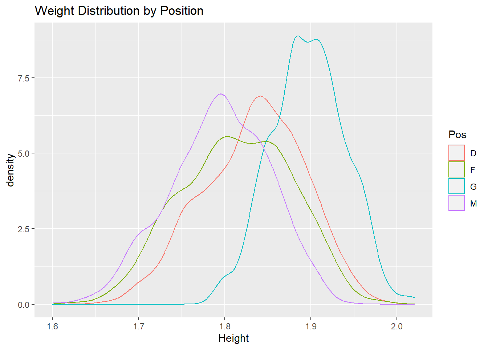

# Introduction

I was interested in how the players in different European Football leagues were different, so I decided to get data and analyze it.


# Scrape Data

I scraped European football data from an online database using the `rvest` package.

Using `rvest`, I got data about every team in the "top 4 leagues" of European Football, which are England, Germany, Italy, and Spain.

Source of Material is http://www.footballsquads.com. Material: © FootballSquads.com, 1999 - 2020, All Rights Reserved

Scraping was a complex process, where I first needed to get the links to the indivual teams for each league.


Then I went through each league's teams, and scraped the table on the site.

I had to add the team name as a column, and remove players who were no longer at their club.


```r
# Stores players from every league
leagues_allplayers = list()

# Go through each league
for(league in 1:length(leagues_teams)) {

  team_names = list()
  team_squads = list()
  
  for(team in 1:length(leagues_teams[[league]])) {
    s = html_session(base_urls[[league]]) %>%
      jump_to(leagues_teams[[league]][team]) %>%
      read_html()
      
    team_names[[team]] <- s %>% 
      html_nodes("h2") %>% 
      html_text
    
    
    team_squads[team] <- s %>% 
      html_table(header = TRUE)
  
  }
  
  # For each team in current league
  for(i in 1:length(team_names)) {
    # Add team name
    team_squads[i] <- lapply(team_squads[i],
                             function(x) cbind(x, Team = team_names[[i]]))
    
    # Remove "Players no longer at this club"
    team_squads[i] <- lapply(team_squads[i],
                             head,
                             n = which(as.data.frame(team_squads[i])$Number == "Players no longer at this club")-1)
  
    leagues_allplayers[[league]] <- bind_rows(team_squads)

  }
}
```

After I had data frames for each league, I wrote a function to add the league name as a column and remove numbers that are missing.


```r
# Function to 
assign_and_remove <- function(index) {
  leagues_allplayers[[index]]["League"] <- league_names[index]
  leagues_allplayers[[index]] <- leagues_allplayers[[index]][
    !(is.na(leagues_allplayers[[index]]$Name) | leagues_allplayers[[index]]$Name==""), ]
  leagues_allplayers[[index]]
}
```


# Map Players to Birth Place

Using the `tidygeocoder` package, we geocode players from each league.


```r
# Geocode
get_coords <- function(index) {
  leagues_allplayers[[index]] %>% 
    geocode(`Birth Place`, method = "osm")
}
```


The geocoded list holds the data frames of players in each of the 4 leagues.


I finally put the data for all 4 leagues together, now that they are mostly prepared for analysis.


```r
top4leagues <- bind_rows(list(geocoded[[1]],
                              geocoded[[2]],
                              geocoded[[3]],
                              geocoded[[4]]))
```


```r
# Remove numbers that are missing
top4leagues <- top4leagues[!(is.na(top4leagues$Name) | top4leagues$Name==""), ]
```


```r
head(top4leagues)
```

```
##   Number                      Name Nat Pos Height Weight Date.of.Birth
## 1      1                Bernd Leno GER   G   1.89     78      04-03-92
## 2      2           Héctor Bellerín ESP   D   1.78     74      19-03-95
## 3      3            Kieran Tierney SCO   D   1.78     70      05-06-97
## 5      5 Sokratis Papastathopoulos GRE   D   1.83     82      09-06-88
## 8      8             Dani Ceballos ESP   M   1.79     71      07-08-96
## 9      9       Alexandre Lacazette FRA   F   1.74     69      28-05-91
##            Birth.Place     Previous.Club    Team  League      lat       long
## 1 Bietigheim-Bissingen  Bayer Leverkusen Arsenal England 48.95026   9.138331
## 2            Barcelona         Barcelona Arsenal England 41.38289   2.177432
## 3              Douglas            Celtic Arsenal England 39.76284 -88.217052
## 5             Kalamata Borussia Dortmund Arsenal England 37.03776  22.110939
## 8               Utrera       Real Madrid Arsenal England 37.18246  -5.781751
## 9                 Lyon              Lyon Arsenal England 45.75781   4.832011
```


I manually added information for some players with missing coordinate data.


```r
# Add information for some notable missing players
top4leagues[top4leagues$Name == "Mohamed Salah", "lat"] = 30.940491
top4leagues[top4leagues$Name == "Mohamed Salah", "long"] = 30.830231
top4leagues[top4leagues$Name == "Bukayo Saka", "lat"] = 51.525
top4leagues[top4leagues$Name == "Bukayo Saka", "long"] = -0.3325
```


```r
# Keep players with lat and long not na
top4leagues2 <- top4leagues[complete.cases(top4leagues[12:13]), ]
```


I created data frames for each country again, and plotted where the players who played in each respective league were born. The color of the dots show their position.

### England


```r
locations_sf <- st_as_sf(england, coords = c("long", "lat"), crs = 4326)
mapview(locations_sf, zcol=c("Pos"))
```

preserve51a88276fe8d05f7

### Germany


```r
locations_sf <- st_as_sf(germany, coords = c("long", "lat"), crs = 4326)
mapview(locations_sf, zcol=c("Pos"))
```

preservee45e1cef5a670c84

### Italy


```r
locations_sf <- st_as_sf(italy, coords = c("long", "lat"), crs = 4326)
mapview(locations_sf, zcol=c("Pos"))
```

preserve27dc35c09c226015

### Spain


```r
locations_sf <- st_as_sf(spain, coords = c("long", "lat"), crs = 4326)
mapview(locations_sf, zcol=c("Pos"))
```

preserved55747cd36d77430

- Players from South Africa tend to play in England
- Asian Players tend to be forwards in England, midfielders in Germany and Spain, and defenders in Italy.

# Nationality Analysis

What are the top 3 nationalities of players in each league?


```r
top4leagues2 %>% 
  group_by(League, Nat) %>% 
  summarise(`Nationality Count` = length(Nat)) %>% 
  arrange(desc(`Nationality Count`)) %>% 
  slice(seq_len(3))
```

```
## # A tibble: 12 x 3
## # Groups:   League [4]
##    League  Nat   `Nationality Count`
##    <chr>   <chr>               <int>
##  1 England ENG                   336
##  2 England IRL                    37
##  3 England FRA                    36
##  4 Germany GER                   252
##  5 Germany AUT                    29
##  6 Germany FRA                    25
##  7 Italy   ITA                   280
##  8 Italy   BRA                    37
##  9 Italy   FRA                    24
## 10 Spain   ESP                   421
## 11 Spain   ARG                    24
## 12 Spain   FRA                    23
```

Every country has more players from its own country than any single foreign country.

# Birthdays


```r
top4leagues3$bd <- dmy(top4leagues3$Date.of.Birth)
top4leagues3$bd_year <- year(top4leagues3$bd)
```


```r
top4leagues3 %>% 
  ggplot(aes(x = bd_year, color = League)) +
  geom_density(stat = "count") +
  ggtitle("Birthday of Active Players")
```




```r
tapply(top4leagues3$bd, top4leagues3$League, summary)
```

```
## $England
##         Min.      1st Qu.       Median         Mean      3rd Qu.         Max. 
## "1980-02-20" "1991-11-20" "1996-06-12" "1995-09-20" "2000-05-16" "2003-10-17" 
##         NA's 
##          "1" 
## 
## $Germany
##         Min.      1st Qu.       Median         Mean      3rd Qu.         Max. 
## "1978-10-03" "1991-02-05" "1994-08-05" "1994-05-10" "1997-11-13" "2002-11-13" 
## 
## $Italy
##         Min.      1st Qu.       Median         Mean      3rd Qu.         Max. 
## "1978-01-28" "1990-09-15" "1994-07-25" "1994-05-11" "1998-12-21" "2003-07-10" 
## 
## $Spain
##         Min.      1st Qu.       Median         Mean      3rd Qu.         Max. 
## "1981-02-11" "1990-09-13" "1994-08-16" "1994-04-10" "1998-01-22" "2002-11-29"
```

# Count per team


```r
top4leagues2 %>% 
  group_by(League, Team) %>% 
  summarise(`Player Count` = length(Team)) %>% 
  arrange(desc(`Player Count`)) %>% 
  head(10)
```

```
## # A tibble: 10 x 3
## # Groups:   League [2]
##    League  Team                        `Player Count`
##    <chr>   <chr>                                <int>
##  1 England "Liverpool"                             54
##  2 England "Tottenham \nHotspur"                   53
##  3 England "Manchester \nUnited"                   52
##  4 England "Chelsea"                               49
##  5 Spain   "\nAtlético Madrid"                     48
##  6 England "Newcastle \nUnited"                    41
##  7 England "Brighton & \nHove Albion"              40
##  8 England "Manchester \nCity"                     40
##  9 Spain   "Real Madrid"                           40
## 10 England "Wolverhampton \nWanderers"             38
```

Liverpool, Tottenham Hotspur, and Manchester United have the highest player count

# Height and Weight per position


```r
top4leagues2 %>% 
  ggplot(aes(x = Height, color = Pos)) +
  geom_density() +
  ggtitle("Height Distribution by Position")
```




```r
tapply(top4leagues2$Height, top4leagues2$Pos, summary)
```

```
## [[1]]
## NULL
## 
## $D
##    Min. 1st Qu.  Median    Mean 3rd Qu.    Max.    NA's 
##   1.660   1.800   1.840   1.834   1.880   1.980      84 
## 
## $F
##    Min. 1st Qu.  Median    Mean 3rd Qu.    Max.    NA's 
##   1.630   1.770   1.820   1.814   1.860   1.980      51 
## 
## $G
##    Min. 1st Qu.  Median    Mean 3rd Qu.    Max.    NA's 
##   1.790   1.870   1.900   1.897   1.920   2.020      33 
## 
## $M
##    Min. 1st Qu.  Median    Mean 3rd Qu.    Max.    NA's 
##   1.600   1.750   1.800   1.794   1.830   1.940      87
```

Goalkeepers have the highest height.


```r
top4leagues2 %>% 
  ggplot(aes(x = Height, color = Pos)) +
  geom_density() +
  ggtitle("Weight Distribution by Position")
```




```r
tapply(top4leagues2$Weight, top4leagues2$Pos, summary)
```

```
## [[1]]
## NULL
## 
## $D
##    Min. 1st Qu.  Median    Mean 3rd Qu.    Max.    NA's 
##   59.00   72.00   76.00   76.15   80.00   97.00      91 
## 
## $F
##    Min. 1st Qu.  Median    Mean 3rd Qu.    Max.    NA's 
##    57.0    70.0    75.0    74.6    79.0   101.0      57 
## 
## $G
##    Min. 1st Qu.  Median    Mean 3rd Qu.    Max.    NA's 
##   65.00   78.00   83.00   82.57   87.00  101.00      42 
## 
## $M
##    Min. 1st Qu.  Median    Mean 3rd Qu.    Max.    NA's 
##      48      68      72      72      76      91      99
```

Goalkeepers have a much larger weight than other positions.
